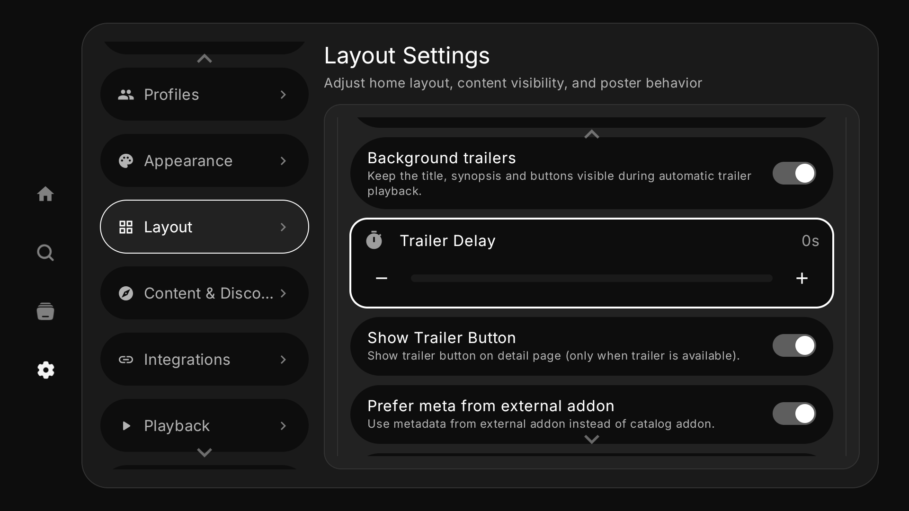

# Background trailers on detail pages

The optional **Background trailers** setting keeps the title, synopsis, metadata,
and action buttons visible during automatic trailer playback. It is disabled by
default, preserving the existing immersive preview. The autoplay delay still
defaults to seven seconds; it can now be set from zero to fifteen seconds. Zero
starts playback when the trailer source is ready, without removing network or
buffering time.

## Reproduction

1. Use the full distribution on Android TV and open **Settings → Layout → Detail
   Page**.
2. Enable automatic trailer playback, enable **Background trailers**, and set
   the delay to **0 s**.
3. Open a movie or series with a playable trailer and focus its Play button.
4. Once playback starts, verify that the title, synopsis, metadata, and actions
   remain visible and that the D-pad moves focus without stopping the trailer.
5. Open sources, scroll down to episodes, or press Back. Playback should stop;
   Back should leave the detail page in one press.
6. Reopen the page and select the explicit Trailer action. This should use the
   existing immersive player with manual controls.
7. Disable **Background trailers** and reopen a detail page. Automatic playback
   should use the existing immersive mode, with Back stopping the trailer first.
8. Leave the app during background playback and return. Playback should remain
   stopped.

The setting is persisted and synchronized per profile through the existing
trailer settings store. Disabling autoplay preserves the background preference.
The feature uses the existing trailer resolver and player.

## Visual evidence

These unedited screenshots were captured on Android TV API 36, x86_64,
1920×1080, using a synthetic local catalog and a generated color-bar video.
They show the original feature implementation at `d16b0d7`, before its rebase
onto `dev`. They are recorded evidence, not a new device run of the PR branch.

| Background setting off: immersive autoplay | Background setting on: details remain visible |
| --- | --- |
|  |  |



## Automated validation

The PR workflow runs the updater tests and `TrailerSettingsDataStoreTest`, then
assembles the full debug APK:

```sh
./gradlew :app:testFullDebugUnitTest \
  --tests 'com.nuvio.tv.updater.*' \
  --tests 'com.nuvio.tv.data.local.TrailerSettingsDataStoreTest' \
  :app:assembleFullDebug --stacktrace
```

The settings test checks default values, zero-second delay, isolation between
profiles, persistence after reopening the preference files, and preservation of
the preference when autoplay is disabled and re-enabled. It does not test
Compose focus or player lifecycle behavior.

The original feature run contained 1,598 tests: 1,579 passed, 18 failed, and one
was skipped. Re-running the 13 affected test classes on the baseline without the
feature (131 tests) reproduced exactly the same 18 failures. This is not a claim
that the full test suite passes.

Eleven recorded UI observations cover film and series playback, D-pad focus,
source selection, episode scrolling, manual trailers, the settings screen,
restoration of immersive autoplay, Back in both modes, and leaving the app.
A later personal preview APK also played a real YouTube trailer in the emulator.
Physical TV performance remains unverified. Local validation disabled the native
Dolby Vision module and used a development signing key; it does not certify all
native playback paths or account integrations.
